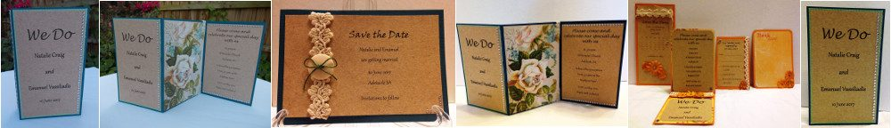
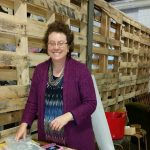

Card Making :: Scrapbooking :: Stamping :: Embellishing

## Welcome to Nat's Paper Craft!

{: style="float: left"}
My name is Natalie.  My love of crafting started with scrapbooking and has grown to include all sorts of paper items, ranging from greeting cards to Advent calendars.  I use simple stamp, scrap, and embellishing techniques to make unique hand-made items.

Apart from the unique creations, I have made multiple items following particular themes for weddings and corporate stationery.

**Follow me on social media to keep abreast of my latest work and news.**

## Shop Online

{: style="float: left"}
A collection of my cards, albums, and other paper creations are available for sale.  The items are reasonably priced and  I think offer better quality and value than you typically find with preprinted cards in other stores. Sales help to recover my costs and make more items! If you see a design you like but would like it modified, please let me know.

&copy; 2021.  Nat's Paper Craft. All Rights Reserved.